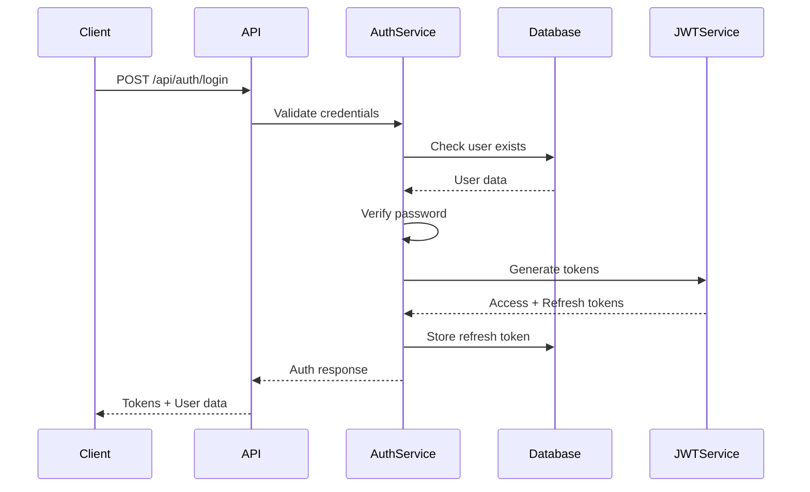
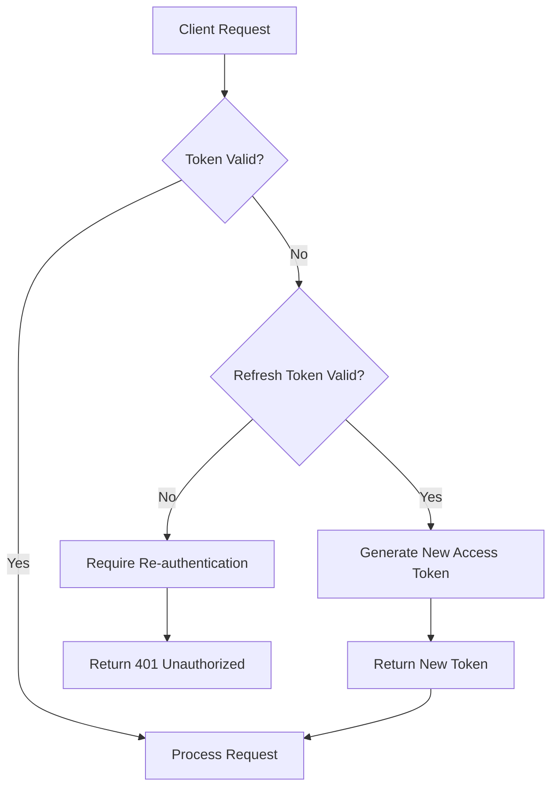
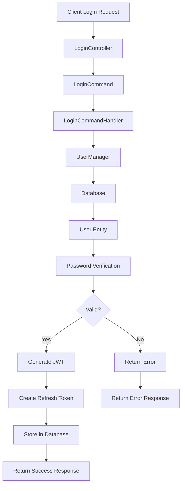
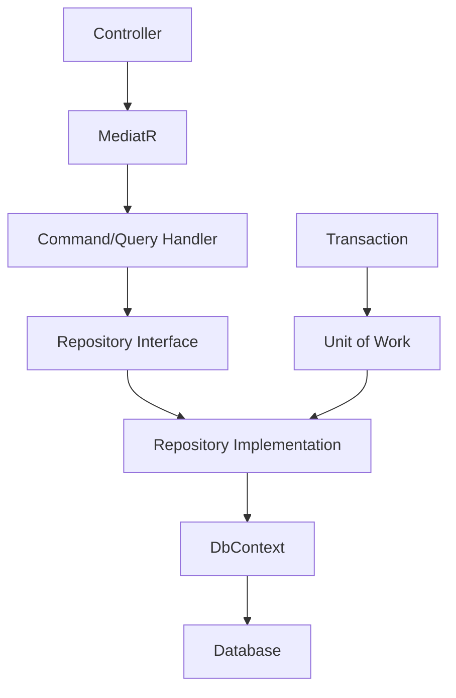

# System Architecture

This document describes the high-level architecture of the Kaopiz Auth system, including design patterns, data flow, and component interactions.

## 🏗️ Overall Architecture

The Kaopiz Auth system follows a **Clean Architecture** pattern with clear separation of concerns:

```
┌─────────────────────────────────────────────────────────┐
│                    Presentation Layer                   │
│  ┌─────────────────┐  ┌─────────────────────────────────┐ │
│  │   Web API       │  │        Web App                  │ │
│  │  (Controllers)  │  │     (Blazor/React)              │ │
│  └─────────────────┘  └─────────────────────────────────┘ │
└─────────────────────────┬───────────────────────────────┘
                          │
┌─────────────────────────▼───────────────────────────────┐
│                 Application Layer                       │
│  ┌─────────────┐  ┌──────────────┐  ┌─────────────────┐ │
│  │  Commands   │  │   Queries    │  │    Handlers     │ │
│  │   (CQRS)    │  │    (CQRS)    │  │   (MediatR)     │ │
│  └─────────────┘  └──────────────┘  └─────────────────┘ │
└─────────────────────────┬───────────────────────────────┘
                          │
┌─────────────────────────▼───────────────────────────────┐
│                   Domain Layer                          │
│  ┌─────────────┐  ┌──────────────┐  ┌─────────────────┐ │
│  │  Entities   │  │  Value       │  │  Domain         │ │
│  │             │  │  Objects     │  │  Services       │ │
│  └─────────────┘  └──────────────┘  └─────────────────┘ │
└─────────────────────────┬───────────────────────────────┘
                          │
┌─────────────────────────▼───────────────────────────────┐
│               Infrastructure Layer                      │
│  ┌─────────────┐  ┌──────────────┐  ┌─────────────────┐ │
│  │ Data Access │  │   External   │  │    Services     │ │
│  │   (EF Core) │  │   Services   │  │  (JWT, Email)   │ │
│  └─────────────┘  └──────────────┘  └─────────────────┘ │
└─────────────────────────────────────────────────────────┘
```

## 🔄 Design Patterns

### 1. Clean Architecture
- **Dependency Inversion**: Dependencies flow inward toward the domain
- **Separation of Concerns**: Each layer has distinct responsibilities
- **Testability**: Domain logic is isolated and easily testable

### 2. CQRS (Command Query Responsibility Segregation)
- **Commands**: Handle write operations (Create, Update, Delete)
- **Queries**: Handle read operations (Get, List)
- **Separation**: Different models for reading and writing

### 3. Repository Pattern
- **Abstraction**: Database access through interfaces
- **Testability**: Easy to mock for unit testing
- **Flexibility**: Can switch data providers

### 4. Unit of Work Pattern
- **Transaction Management**: Groups related operations
- **Consistency**: Ensures data integrity across operations

## 📦 Project Structure

```
src/
├── KaopizAuth.Domain/              # Domain Layer
│   ├── Entities/                   # Domain entities
│   │   ├── ApplicationUser.cs
│   │   ├── ApplicationRole.cs
│   │   └── RefreshToken.cs
│   ├── ValueObjects/               # Value objects
│   ├── Interfaces/                 # Domain interfaces
│   └── Common/                     # Shared domain logic
│
├── KaopizAuth.Application/         # Application Layer
│   ├── Commands/                   # Command handlers
│   │   └── Auth/
│   │       ├── LoginCommand.cs
│   │       ├── LoginCommandHandler.cs
│   │       └── LogoutCommand.cs
│   ├── Queries/                    # Query handlers
│   ├── Common/                     # Shared application logic
│   │   ├── Interfaces/
│   │   ├── Models/
│   │   └── Behaviors/
│   └── DependencyInjection.cs
│
├── KaopizAuth.Infrastructure/      # Infrastructure Layer
│   ├── Data/                       # Data access
│   │   ├── ApplicationDbContext.cs
│   │   ├── Configurations/
│   │   └── Repositories/
│   ├── Services/                   # External services
│   │   ├── Authentication/
│   │   ├── Email/
│   │   └── Logging/
│   └── DependencyInjection.cs
│
└── KaopizAuth.WebAPI/              # Presentation Layer
    ├── Controllers/                # API controllers
    ├── Middleware/                 # Custom middleware
    ├── Configuration/              # App configuration
    └── Program.cs                  # Application entry point
```

## 🔐 Security Architecture

### Authentication Flow


### Token Management


### Security Layers

1. **Transport Security**
   - HTTPS/TLS encryption
   - HSTS headers
   - Secure cookie settings

2. **Authentication**
   - JWT token-based authentication
   - Refresh token rotation
   - Token expiration management

3. **Authorization**
   - Role-based access control (RBAC)
   - Claim-based authorization
   - Resource-level permissions

4. **Input Validation**
   - FluentValidation for request validation
   - Model binding validation
   - SQL injection prevention (EF Core)

5. **Rate Limiting**
   - IP-based rate limiting
   - User-based rate limiting
   - Endpoint-specific limits

## 📊 Data Flow

### Login Process


### Data Access Pattern


## 🏢 Component Responsibilities

### Domain Layer
```csharp
// Domain entities contain business logic
public class ApplicationUser : IdentityUser<Guid>
{
    public string FirstName { get; set; }
    public string LastName { get; set; }
    public string FullName => $"{FirstName} {LastName}";
    public bool IsActive { get; set; }
    public List<RefreshToken> RefreshTokens { get; set; }
    
    // Business methods
    public void Activate() => IsActive = true;
    public void Deactivate() => IsActive = false;
}
```

### Application Layer
```csharp
// Command handlers orchestrate business operations
public class LoginCommandHandler : IRequestHandler<LoginCommand, ApiResponse<LoginResponse>>
{
    public async Task<ApiResponse<LoginResponse>> Handle(LoginCommand request, CancellationToken cancellationToken)
    {
        // 1. Validate input
        // 2. Authenticate user
        // 3. Generate tokens
        // 4. Return response
    }
}
```

### Infrastructure Layer
```csharp
// Repositories implement data access
public class UserRepository : IUserRepository
{
    private readonly ApplicationDbContext _context;
    
    public async Task<ApplicationUser> GetByEmailAsync(string email)
    {
        return await _context.Users
            .Include(u => u.RefreshTokens)
            .FirstOrDefaultAsync(u => u.Email == email);
    }
}
```

## 📈 Scalability Considerations

### Horizontal Scaling
- **Stateless Design**: No server-side session state
- **Database Connection Pooling**: Efficient connection management
- **Caching Strategy**: Redis for distributed caching
- **Load Balancing**: Multiple API instances

### Performance Optimization
- **Async/Await**: Non-blocking operations
- **Connection Pooling**: Database efficiency
- **Query Optimization**: Entity Framework projections
- **Response Compression**: Reduced bandwidth

### Monitoring & Observability
- **Structured Logging**: Serilog with correlation IDs
- **Health Checks**: Endpoint monitoring
- **Metrics Collection**: Application insights
- **Distributed Tracing**: Request flow tracking

## 🔧 Configuration Management

### Environment-Specific Settings
```csharp
public class JwtSettings
{
    public string Key { get; set; }
    public string Issuer { get; set; }
    public string Audience { get; set; }
    public int ExpireMinutes { get; set; }
}

// Configuration binding
services.Configure<JwtSettings>(configuration.GetSection("Jwt"));
```

### Dependency Injection
```csharp
// Infrastructure layer registration
services.AddScoped<IUserRepository, UserRepository>();
services.AddScoped<IJwtTokenService, JwtTokenService>();
services.AddScoped<IEmailService, EmailService>();

// Application layer registration
services.AddMediatR(typeof(LoginCommandHandler));
services.AddAutoMapper(typeof(UserProfile));
```

## 🚀 Deployment Architecture

### Development Environment
```
┌─────────────────┐    ┌─────────────────┐
│   Developer     │    │   Local DB      │
│   Machine       │────│   PostgreSQL    │
│   (API + UI)    │    │                 │
└─────────────────┘    └─────────────────┘
```

### Production Environment
```
                    ┌─────────────────┐
                    │  Load Balancer  │
                    │   (nginx/ALB)   │
                    └─────────┬───────┘
                              │
                    ┌─────────▼───────┐
                    │   API Gateway   │
                    │                 │
                    └─────────┬───────┘
                              │
        ┌─────────────────────┼─────────────────────┐
        │                     │                     │
┌───────▼───────┐    ┌───────▼───────┐    ┌───────▼───────┐
│   API Server  │    │   API Server  │    │   API Server  │
│   Instance 1  │    │   Instance 2  │    │   Instance 3  │
└───────────────┘    └───────────────┘    └───────────────┘
        │                     │                     │
        └─────────────────────┼─────────────────────┘
                              │
                    ┌─────────▼───────┐
                    │   Database      │
                    │   PostgreSQL    │
                    │   (Primary)     │
                    └─────────────────┘
```

## 🔄 Event-Driven Architecture (Future)

### Domain Events
```csharp
public class UserLoggedInEvent : INotification
{
    public Guid UserId { get; set; }
    public string Email { get; set; }
    public DateTime LoginTime { get; set; }
    public string IpAddress { get; set; }
}

// Event handler
public class UserLoggedInEventHandler : INotificationHandler<UserLoggedInEvent>
{
    public async Task Handle(UserLoggedInEvent notification, CancellationToken cancellationToken)
    {
        // Log audit event
        // Send notification email
        // Update user statistics
    }
}
```

## 📋 Quality Attributes

### Reliability
- **Error Handling**: Comprehensive exception management
- **Circuit Breaker**: Fail-fast for external services
- **Retry Policies**: Transient fault handling

### Security
- **Defense in Depth**: Multiple security layers
- **Principle of Least Privilege**: Minimal required permissions
- **Secure by Default**: Secure configuration defaults

### Maintainability
- **Clean Code**: SOLID principles
- **Automated Testing**: Unit, integration, and E2E tests
- **Documentation**: Comprehensive API and code documentation

### Performance
- **Caching**: Multi-level caching strategy
- **Database Optimization**: Proper indexing and queries
- **Async Processing**: Non-blocking operations

---

This architecture provides a solid foundation for a scalable, maintainable, and secure authentication system.