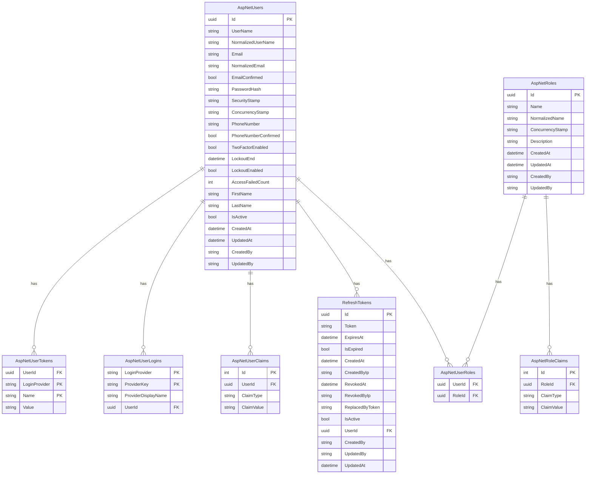

# Database Schema Documentation

This document describes the database schema for the Kaopiz Auth system, including tables, relationships, and design decisions.

## 🗄️ Database Overview

- **Database Engine**: PostgreSQL 15+
- **ORM**: Entity Framework Core 8.0
- **Migration Strategy**: Code-First with EF Migrations
- **Naming Convention**: Snake_case for tables and columns

## 📊 Entity Relationship Diagram



## 📋 Table Specifications

### AspNetUsers (Application Users)

Primary table for user accounts.

| Column | Type | Constraints | Description |
|--------|------|-------------|-------------|
| Id | UUID | PK, NOT NULL | Unique user identifier |
| UserName | VARCHAR(256) | UNIQUE, NOT NULL | Username (same as email) |
| NormalizedUserName | VARCHAR(256) | UNIQUE, NOT NULL | Uppercase username for queries |
| Email | VARCHAR(256) | UNIQUE, NOT NULL | User email address |
| NormalizedEmail | VARCHAR(256) | UNIQUE, NOT NULL | Uppercase email for queries |
| EmailConfirmed | BOOLEAN | NOT NULL, DEFAULT FALSE | Email verification status |
| PasswordHash | TEXT | NULL | Hashed password |
| SecurityStamp | TEXT | NULL | Security token for invalidating cookies |
| ConcurrencyStamp | TEXT | NULL | Optimistic concurrency token |
| PhoneNumber | VARCHAR(50) | NULL | User phone number |
| PhoneNumberConfirmed | BOOLEAN | NOT NULL, DEFAULT FALSE | Phone verification status |
| TwoFactorEnabled | BOOLEAN | NOT NULL, DEFAULT FALSE | 2FA enablement status |
| LockoutEnd | TIMESTAMPTZ | NULL | Account lockout expiration |
| LockoutEnabled | BOOLEAN | NOT NULL, DEFAULT TRUE | Can account be locked |
| AccessFailedCount | INTEGER | NOT NULL, DEFAULT 0 | Failed login attempts |
| FirstName | VARCHAR(100) | NOT NULL | User first name |
| LastName | VARCHAR(100) | NOT NULL | User last name |
| IsActive | BOOLEAN | NOT NULL, DEFAULT TRUE | Account active status |
| CreatedAt | TIMESTAMPTZ | NOT NULL, DEFAULT NOW() | Record creation time |
| UpdatedAt | TIMESTAMPTZ | NOT NULL, DEFAULT NOW() | Record last update time |
| CreatedBy | VARCHAR(100) | NOT NULL | Who created the record |
| UpdatedBy | VARCHAR(100) | NOT NULL | Who last updated the record |

**Indexes:**
```sql
CREATE INDEX IX_AspNetUsers_NormalizedUserName ON AspNetUsers (NormalizedUserName);
CREATE INDEX IX_AspNetUsers_NormalizedEmail ON AspNetUsers (NormalizedEmail);
CREATE INDEX IX_AspNetUsers_IsActive ON AspNetUsers (IsActive);
CREATE INDEX IX_AspNetUsers_CreatedAt ON AspNetUsers (CreatedAt);
```

### RefreshTokens

Stores refresh tokens for JWT authentication.

| Column | Type | Constraints | Description |
|--------|------|-------------|-------------|
| Id | UUID | PK, NOT NULL | Unique token identifier |
| Token | VARCHAR(500) | UNIQUE, NOT NULL | Refresh token value |
| ExpiresAt | TIMESTAMPTZ | NOT NULL | Token expiration time |
| IsExpired | BOOLEAN | COMPUTED | Whether token is expired |
| CreatedAt | TIMESTAMPTZ | NOT NULL, DEFAULT NOW() | Token creation time |
| CreatedByIp | VARCHAR(45) | NULL | IP address of creation |
| RevokedAt | TIMESTAMPTZ | NULL | Token revocation time |
| RevokedByIp | VARCHAR(45) | NULL | IP address of revocation |
| ReplacedByToken | VARCHAR(500) | NULL | Token that replaced this one |
| IsActive | BOOLEAN | COMPUTED | Whether token is active |
| UserId | UUID | FK, NOT NULL | Owner user ID |
| CreatedBy | VARCHAR(100) | NOT NULL | Who created the record |
| UpdatedBy | VARCHAR(100) | NOT NULL | Who last updated the record |
| UpdatedAt | TIMESTAMPTZ | NOT NULL, DEFAULT NOW() | Record last update time |

**Computed Columns:**
```sql
-- IsExpired: Token is past expiration date
IsExpired = (ExpiresAt < NOW())

-- IsActive: Token is not expired and not revoked
IsActive = (ExpiresAt > NOW() AND RevokedAt IS NULL)
```

**Indexes:**
```sql
CREATE INDEX IX_RefreshTokens_Token ON RefreshTokens (Token);
CREATE INDEX IX_RefreshTokens_UserId ON RefreshTokens (UserId);
CREATE INDEX IX_RefreshTokens_ExpiresAt ON RefreshTokens (ExpiresAt);
CREATE INDEX IX_RefreshTokens_IsActive ON RefreshTokens (IsActive) WHERE IsActive = true;
```

**Foreign Keys:**
```sql
ALTER TABLE RefreshTokens 
ADD CONSTRAINT FK_RefreshTokens_AspNetUsers_UserId 
FOREIGN KEY (UserId) REFERENCES AspNetUsers (Id) ON DELETE CASCADE;
```

### AspNetRoles (Application Roles)

Defines user roles in the system.

| Column | Type | Constraints | Description |
|--------|------|-------------|-------------|
| Id | UUID | PK, NOT NULL | Unique role identifier |
| Name | VARCHAR(256) | UNIQUE, NOT NULL | Role name |
| NormalizedName | VARCHAR(256) | UNIQUE, NOT NULL | Uppercase role name |
| ConcurrencyStamp | TEXT | NULL | Optimistic concurrency token |
| Description | VARCHAR(500) | NULL | Role description |
| CreatedAt | TIMESTAMPTZ | NOT NULL, DEFAULT NOW() | Record creation time |
| UpdatedAt | TIMESTAMPTZ | NOT NULL, DEFAULT NOW() | Record last update time |
| CreatedBy | VARCHAR(100) | NOT NULL | Who created the record |
| UpdatedBy | VARCHAR(100) | NOT NULL | Who last updated the record |

**Default Roles:**
```sql
INSERT INTO AspNetRoles (Id, Name, NormalizedName, Description, CreatedBy, UpdatedBy)
VALUES 
    (gen_random_uuid(), 'User', 'USER', 'Standard user role', 'System', 'System'),
    (gen_random_uuid(), 'Admin', 'ADMIN', 'Administrator role', 'System', 'System'),
    (gen_random_uuid(), 'SuperAdmin', 'SUPERADMIN', 'Super administrator role', 'System', 'System');
```

## 🔐 Security Considerations

### Password Security
- **Hashing**: BCrypt with salt (handled by ASP.NET Core Identity)
- **Complexity**: Minimum 8 characters, uppercase, lowercase, digit
- **History**: Consider implementing password history to prevent reuse

### Token Security
- **Refresh Tokens**: Long-lived, stored securely, can be revoked
- **Access Tokens**: Short-lived (15 minutes), not stored in database
- **Token Rotation**: Refresh tokens are replaced on each refresh

### Data Protection
- **Encryption at Rest**: Database-level encryption
- **PII Protection**: Email and phone number encryption consideration
- **Audit Trail**: CreatedBy, UpdatedBy, CreatedAt, UpdatedAt on all tables

## 📈 Performance Optimization

### Indexing Strategy
```sql
-- Primary lookup indexes
CREATE INDEX IX_AspNetUsers_Email ON AspNetUsers (NormalizedEmail);
CREATE INDEX IX_AspNetUsers_UserName ON AspNetUsers (NormalizedUserName);

-- Authentication-related indexes
CREATE INDEX IX_RefreshTokens_UserId_Active ON RefreshTokens (UserId) WHERE IsActive = true;
CREATE INDEX IX_AspNetUsers_Active ON AspNetUsers (IsActive) WHERE IsActive = true;

-- Cleanup indexes
CREATE INDEX IX_RefreshTokens_ExpiresAt_Expired ON RefreshTokens (ExpiresAt) WHERE ExpiresAt < NOW();
```

### Query Optimization
```sql
-- Efficient user lookup with roles
SELECT u.*, r.Name as RoleName
FROM AspNetUsers u
LEFT JOIN AspNetUserRoles ur ON u.Id = ur.UserId
LEFT JOIN AspNetRoles r ON ur.RoleId = r.Id
WHERE u.NormalizedEmail = UPPER(@email) AND u.IsActive = true;

-- Active refresh tokens for user
SELECT * FROM RefreshTokens 
WHERE UserId = @userId AND IsActive = true
ORDER BY CreatedAt DESC;
```

## 🧹 Data Maintenance

### Cleanup Procedures

#### Expired Token Cleanup
```sql
-- Delete expired refresh tokens older than 30 days
DELETE FROM RefreshTokens 
WHERE ExpiresAt < NOW() - INTERVAL '30 days';
```

#### Inactive User Cleanup
```sql
-- Archive users inactive for more than 2 years
UPDATE AspNetUsers 
SET IsActive = false 
WHERE LastLoginAt < NOW() - INTERVAL '2 years' 
AND IsActive = true;
```

### Backup Strategy
- **Full Backup**: Daily at 2 AM UTC
- **Incremental Backup**: Every 6 hours
- **Point-in-Time Recovery**: Transaction log backup every 15 minutes
- **Retention**: 30 days for full backups, 7 days for logs

## 🔄 Migration Scripts

### Initial Migration
```csharp
public partial class InitialCreate : Migration
{
    protected override void Up(MigrationBuilder migrationBuilder)
    {
        // Create AspNetUsers table
        migrationBuilder.CreateTable(
            name: "AspNetUsers",
            columns: table => new
            {
                Id = table.Column<Guid>(type: "uuid", nullable: false),
                FirstName = table.Column<string>(type: "character varying(100)", maxLength: 100, nullable: false),
                LastName = table.Column<string>(type: "character varying(100)", maxLength: 100, nullable: false),
                IsActive = table.Column<bool>(type: "boolean", nullable: false, defaultValue: true),
                // ... other Identity columns
            },
            constraints: table =>
            {
                table.PrimaryKey("PK_AspNetUsers", x => x.Id);
            });

        // Create RefreshTokens table
        migrationBuilder.CreateTable(
            name: "RefreshTokens",
            columns: table => new
            {
                Id = table.Column<Guid>(type: "uuid", nullable: false),
                Token = table.Column<string>(type: "character varying(500)", maxLength: 500, nullable: false),
                ExpiresAt = table.Column<DateTime>(type: "timestamp with time zone", nullable: false),
                UserId = table.Column<Guid>(type: "uuid", nullable: false),
                // ... other columns
            },
            constraints: table =>
            {
                table.PrimaryKey("PK_RefreshTokens", x => x.Id);
                table.ForeignKey(
                    name: "FK_RefreshTokens_AspNetUsers_UserId",
                    column: x => x.UserId,
                    principalTable: "AspNetUsers",
                    principalColumn: "Id",
                    onDelete: ReferentialAction.Cascade);
            });
    }
}
```

## 📊 Database Statistics

### Estimated Storage Requirements

| Table | Est. Rows (1 year) | Size per Row | Total Size |
|-------|-------------------|--------------|------------|
| AspNetUsers | 10,000 | 1KB | 10MB |
| RefreshTokens | 50,000 | 0.5KB | 25MB |
| AspNetRoles | 10 | 0.2KB | 2KB |
| AspNetUserRoles | 15,000 | 32B | 480KB |
| Total | | | ~36MB |

### Growth Projections
- **Users**: 1,000 new users per month
- **Refresh Tokens**: 5 tokens per user per month (average)
- **Annual Growth**: ~40MB per year

## 🔍 Monitoring Queries

### Health Check Queries
```sql
-- Check database connectivity
SELECT 1;

-- Count active users
SELECT COUNT(*) as ActiveUsers FROM AspNetUsers WHERE IsActive = true;

-- Count active tokens
SELECT COUNT(*) as ActiveTokens FROM RefreshTokens WHERE IsActive = true;

-- Check for old expired tokens (cleanup needed)
SELECT COUNT(*) as ExpiredTokens 
FROM RefreshTokens 
WHERE ExpiresAt < NOW() - INTERVAL '7 days';
```

### Performance Monitoring
```sql
-- Long-running queries
SELECT query, calls, total_time, mean_time 
FROM pg_stat_statements 
WHERE mean_time > 100 
ORDER BY mean_time DESC;

-- Index usage
SELECT schemaname, tablename, indexname, idx_scan, idx_tup_read
FROM pg_stat_user_indexes 
ORDER BY idx_scan DESC;
```

---

This schema provides a robust foundation for the authentication system with considerations for performance, security, and maintainability.